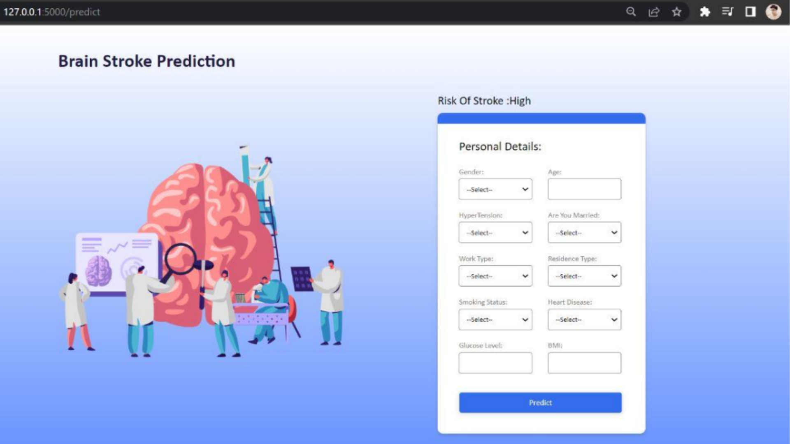

# Brain Stroke Prediction using Machine Learning

Brain stroke is a leading cause of disability and mortality worldwide. Early detection and diagnosis of stroke are critical to prevent long-term disability and improve patient outcomes. Machine learning (ML) has shown great potential in the prediction of stroke risk, and several ML models have been developed for this purpose.

This repository contains a machine learning pipeline for brain stroke prediction, which includes data preprocessing, feature selection, model development, and evaluation.

## Dataset

The dataset used for this project can be found [here](https://drive.google.com/file/d/1yruyN0GYpe0SiyyE57rXxANk1Mz0ckhX/view?usp=sharing).

### Features

- Categorical Features: gender, ever_married, work_type, residence_type, smoking_status.
- Binary Numerical Features: hypertension, heart_disease, stroke.
- Continuous Numerical Features: age, avg_glucose_level, bmi.

## Machine Learning Pipeline

### Preprocessing

- Fitted label encoder on the columns with object data type to convert them into numerical values.
- Split the data into train and test sets with stratified splits to maintain the proportion of classes in both training and testing datasets.
- Handled missing values and applied SMOTE for oversampling due to the highly imbalanced dataset.

### Feature Selection

- Implemented feature selection using correlation analysis, PCA, LDA, and t-SNE transformations.
- Selected features for training: [age, avg_glucose_level, bmi, work_type, smoking_status, ever_married].

### Model Development

Trained and tested the following machine learning models:

- Decision Tree Classifier (DTC)
- Bagging Classifier
- Random Forest Classifier
- Logistic Regression
- XGB Classifier
- Naive Bayes Classifier
- SVM Classifier
- Multi-layer Perceptron
- Voting Classification with Bagging

### Evaluation

Compared the performance of each model using various evaluation metrics such as accuracy, precision, recall, and F1-score.

## Website

Created a website using HTML, CSS, and Flask, where users can input their details, which are then passed to the model for prediction.

## Contributors

- Shashwat Roy (B21CS071): Data transformations, model training, parameter tuning, and report writing.
- Pranav Pant (B21CS088): Data analysis, preprocessing, model training, website development, and report writing.
- Yogesh Jangir (B21CS083): Data visualization, model training, website development, and report writing.

## Conclusion

The machine learning pipeline developed in this project provides an accurate and efficient tool for stroke prediction, which can aid healthcare professionals in making timely and informed decisions for better patient care.

For detailed implementation and results, please refer to the collab file and the report in this repository.

